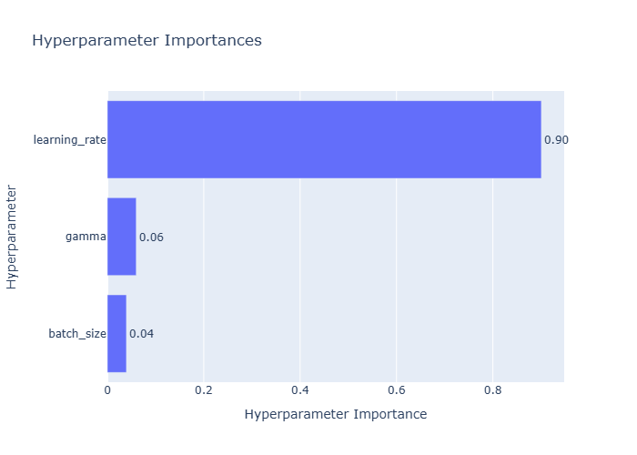

# Reinforcement Learning Project

This repository contains code for experimenting with reinforcement learning algorithms using [Stable-Baselines3](https://github.com/DLR-RM/stable-baselines3). The code is organized to make it easy to train agents, evaluate them, and perform hyperparameter optimization. Examples target locomotion tasks such as `HalfCheetah-v5`, yet the utilities can be reused with any Gymnasium environment and the supported algorithms (SAC, PPO, TD3).

---

## Table of Contents
- [Environment](#environment)
- [Requirements installation](#requirements-installation)
- [Repository Structure](#repository-structure)
- [Hyperparameter Optimization](#hyperparameter-optimization-hpo)
- [Running the Full Workflow](#running-the-full-workflow)
- [Final Training & Model Performance](#final-training--model-performance)
- [Challenges & Key Problems](#challenges--key-problems)
- [Visualizing a trained agent](#Visualizing-a-trained-agent)

---

## Environment

`HalfCheetah-v5` is a continuous-control task built with the MuJoCo physics engine. Observations are 17-dimensional (joint positions/velocities, excluding absolute x) and actions are 6-dimensional torque commands. Episodes last 1,000 steps; the reward encourages forward velocity and penalizes excessive control.

The helper `make_env()` in `env/env_setup.py` exposes a `frame_skip` parameter (default `5`) and seeds the environment for reproducibility.

> **Note on `frame_skip`**  
> Each agent action is applied for `frame_skip` physics steps. Lower values (e.g., 1) increase control resolution but slow simulation and may reduce stability; higher values speed up motion and often stabilize training at the cost of fewer decision points.

---

## Requirements installation 

```bash
python -m venv .venv
source .venv/bin/activate     # Windows: .venv\Scripts\activate
pip install -r requirements.txt
```

---

## Repository Structure

```
RL_project_24_25/
├── env/
│   └── env_setup.py                 # make_env(): Gymnasium wrapper + seeding + frame_skip
├── train/
│   ├── train_utils.py               # init_agent(), learn_segment(), save/close helpers
│   └── __init__.py                  # package marker
├── eval/
│   ├── random_baseline.py           # collect random-policy rewards (npz) with fixed seeds
│   ├── eval_suite.py                # checkpoint eval: rewards, boxplot/hist, mp4+gif, meta
│   ├── compare_baseline_vs_training.py  # plot training curve vs random baseline band
│   ├── plot_learning_curve.py       # plot mean±std episodic rewards over timesteps
│   └── checkpoint_summary.py        # barplot of mean returns at 25/50/100% checkpoints
├── utils/
│   ├── io.py                        # output dirs, run folders, safe path utilities
│   ├── logging.py                   # minimal logger configuration
│   └── video.py                     # mp4 → gif via ffmpeg (palettegen + paletteuse)
├── optimize_hyperparams.py          # Optuna HPO (fast run configuration)
├── run_all.py                       # end-to-end: baseline → train segments → checkpoints
├── visualize.py                     # render a trained agent for a few episodes
└── requirements.txt                 # pinned dependencies
```

---

## Hyperparameter Optimization (HPO)

We ran **two HPO rounds** for SAC on `HalfCheetah-v5`: a broad search to identify impactful knobs, followed by a focused refinement on the learning rate (LR). The goal was to lock a robust configuration for the final training.

### Round 1 — Broad search

**Setup**
- Single environment (`DummyVecEnv`, n_envs = 1); 
- n_trials = **20**
- Per-trial training budget: **30k steps**; **2 evaluations/trial** (~every 15k); **1 episode/eval**  
- Search space:
  - `learning_rate` ∈ [1e-4, 3e-3] (log-uniform)
  - `batch_size` ∈ {128, 160, 192, 224, 256}
  - `gamma` ∈ [0.99, 0.997] *(kept in a high-discount regime to preserve long-horizon credit assignment and avoid myopic policies)*

#### Result

**Optimization history**  


*Fast improvement in early trials, then a stable plateau.*

**Parallel coordinates** 


*Top trials cluster around **lr ≈ 1.6e-3** with **batch_size = 128**; `gamma` sits in a high-discount band.*

**Hyperparameter importances** 



*LR is the dominant driver; `batch_size` and `gamma` are secondary within this range. This directly **motivated a targeted Round 2** that tunes **only** the learning rate.*

**Best hyperparameters**
```json
{
  "learning_rate": 0.0016337684595557117,
  "batch_size": 128,
  "gamma": 0.992712289037351
}
```
### Round 2 — Learning-rate refinement

**Setup**
- Single environment (`DummyVecEnv`, n_envs = 1); 
- n_trials = **10**
- Per-trial training budget: **30k steps**; **2 evaluations/trial** (~every 15k); **1 episode/eval**  
- Search space:
  - `learning_rate` ∈ [1e-3, 2.5e-3] (log-uniform) — *narrowed around the Round-1 optimum*
  - `batch_size` = 128
  - `gamma` = 0.992712289037351

**Best hyperparameters**
```json
{
  "learning_rate":  0.0017445833077795192,
  "batch_size": 128,
  "gamma": 0.992712289037351
}
```

**HPO output structure:**

```
optuna_results/plots/<ALGO>_<ENV>/<timestamp>/
├── history.png         # optimization history
├── importances.png     # hyperparameter importances
├── parallel.png        # parallel coordinates plot
├── results.json        # best_params + trial data 
├── slice.png           # slice plot
└── trials.csv          # all the run's trials
```

**Conclusion**

Round 2 nudged the LR *slightly upward* (≈1.63e-3 → ≈1.74e-3), confirming the same *high-performing band* of Round 1.

---

## Running the Full Workflow

Run `python run_all.py` to execute the entire training workflow:

1. **Load best hyperparameters** from `results.json` (path in `BEST_PARAMS_JSON`).
2. **Initialize agent & environments**, saving:
   - `seeds.json` — list of 10 fixed seeds used for all evaluations.
3. **Collect a random baseline** (once) with the same seeds:
   - `random_baseline_rewards.npz` — episodic returns from the random policy (N=10 episodes).
4. **Configure a shared EvalCallback** using aggregated eval frequency `EVAL_FREQ_AGG`  
   (internally converted to per-call steps as `ceil(EVAL_FREQ_AGG / n_envs)`).
5. **Train in segments** to reach:
   - 25% of `TOTAL_TIMESTEPS`
   - 50% of `TOTAL_TIMESTEPS`
   - 100% of `TOTAL_TIMESTEPS`  
   *(continuous timesteps; `reset_num_timesteps=False`)*
6. **At each checkpoint**:
   - Run deterministic evaluation (`N=10` episodes, single env)
   - Save in `checkpoints/{025,050,100}/`:
     - `trained_rewards.npz` — episodic returns from trained policy
     - `boxplot_trained_vs_random.png` — boxplot comparing trained vs random returns
     - `trained_rewards_hist.png` — histogram of trained returns
     - `rollout.mp4` — video of one evaluation episode
     - `rollout.gif` — lightweight GIF version of the rollout
     - `model.zip` — policy snapshot at checkpoint
     - `meta.json` — metadata (algo, env, steps, seeds)
7. **After the last segment**, generate in the run root:
   - `evaluations.npz` — all training eval results from `EvalCallback`
   - `learning_curve.png` — mean ± std episodic return over time
   - `comparison.png` — learning curve overlaid with random baseline band
   - `checkpoint_means_barplot.png` — mean returns at 25/50/100%
8. **Save final model** (if present) as `final_model.zip` and close environments.

**Final folder structure:**

```
results/<ALGO>_<ENV_ID>/<run>/
├── seeds.json # reproducibility seeds
├── random_baseline_rewards.npz # random-policy rewards (N=10)
├── evaluations.npz # training eval data
├── learning_curve.png # from evaluations.npz
├── comparison.png # curve vs random baseline
├── checkpoint_means_barplot.png # mean returns at 25/50/100%
├── best_model.zip # best eval snapshot
├── final_model.zip # (optional) last-step model
└── checkpoints/
├── 025/
│ ├── trained_rewards.npz
│ ├── boxplot_trained_vs_random.png
│ ├── trained_rewards_hist.png
│ ├── rollout.mp4
│ ├── rollout.gif
│ ├── model.zip
│ └── meta.json
├── 050/ ... (same files)
└── 100/ ... (same files)
```

`evaluations.npz` stores the episodic rewards collected during training via `EvalCallback`, and is used to generate `learning_curve.png`.Within each checkpoint folder, `trained_rewards.npz` contains the post-training evaluation returns for the saved policy, which are used to produce `trained_rewards_hist.png` and `boxplot_trained_vs_random.png` (together with `random_baseline_rewards.npz`). Finally, `comparison.png` overlays the learning curve with the random-policy statistics from `random_baseline_rewards.npz`.

---

## Final Training & Model Performance

### Configuration

- **Total timesteps**: 2,000,000 (aggregated)
- **Evaluation frequency**: every 50,000 timesteps (aggregated)
- **Evaluations per checkpoint**: N = 10 episodes (single env, deterministic)
- **Checkpoints**: 25%, 50%, 100% of training
- **Replay buffer size**: 1,000,000
- **Device**: CPU
- **Seeds**: fixed list of 10 for full reproducibility
- **Special training setting**: reset noise scale = **0.15** during training, **0.10** during all evaluations  
  *(higher noise in training was used to encourage robust policy learning and avoid overfitting to narrow initial conditions)*

### Results

**Learning Curve vs Random Baseline**  


*Shows the mean ± std episodic reward during training, overlaid with the random-policy baseline.*

**Checkpoint Mean Returns**


*Mean episodic returns (N=10) at each checkpoint.*

**Final Policy Rollout (100%)**


*A demonstration of the trained policy at the end of training.*

### Performance Summary

- **Final mean return** (100%): ~11,483
- The agent achieves stable locomotion with smooth gait and high forward velocity, matching or exceeding typical SAC HalfCheetah-v5 benchmarks reported in literature.
- Rapid early improvement followed by a stable plateau after ~1.2M steps.

---

## Challenges & Key Problems

During the development of this project, several challenges were identified and addressed:

### 1. **Policy Exploits & Gait Instability**
- **Problem sequence**:
  1. **Initial Flip Exploit** — With low `reset_noise_scale` (0.10), the agent quickly discovered a local-optimum behavior: performing a forward flip right after episode start, gaining high reward without learning a stable gait.
  2. **On-Toes Gait** — To counter the flip exploit,`reset_noise_scale` has been increased to 0.20 during training. This removed the flip, but introduced a new issue: the agent developed an unnatural "on-toes" gait that persisted throughout episodes.
- **Solution**: Adjust `reset_noise_scale` to **0.15** during training (keeping 0.10 for evaluations). This balanced initial state variability: enough to prevent the flip exploit, but not so much as to destabilize gait development.

### 2. **Slow Plateau and Extended Training**
- **Problem**: With the optimized configuration, the learning curve was still rising after 1.2M timesteps, showing no plateau.
- **Solution**: Extend total training budget from **1.2M** to **2.0M** timesteps, keeping all other parameters identical. This allowed the learning curve to stabilize and reach peak performance.

### 3. **Hyperparameter Search Pitfalls**
- **Problem**: Early HPO with many parallel environments and default SAC update settings produced ultra-low learning rates and poor learning due to mismatched updates-per-sample ratio.
- **Solution**:  
  - Use **single-environment** setup for HPO to preserve consistent update ratios.  
  - Restrict search space to *sensible ranges* (Zoo-like defaults) for `learning_rate`, `batch_size`, and `gamma`.

### 4. **Alignment of Checkpoints and Evaluation Frequency**
- **Problem**: Checkpoint steps were not always multiples of the evaluation frequency, risking misaligned metrics.
- **Solution**: Add alignment checks in `run_all.py` to ensure each checkpoint step count is a multiple of `EVAL_FREQ_AGG`.

**Impact**  
These adjustments collectively:
- Eliminated reward exploitation shortcuts.
- Increased robustness of learned policies.
- Preserved comparability of evaluation metrics.
- Achieved one of the highest recorded SAC HalfCheetah-v5 returns in our tests (~11,483 mean final return).

---

## Visualizing a trained agent

Use `python visualize.py` to render the latest agent. This script loads `best_model.zip`, creates a single `DummyVecEnv` with rendering enabled and plays a few episodes on CPU.

## Notes & Caveats
